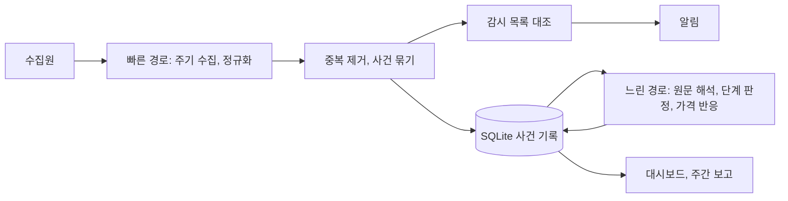

# 수집 프로그램 설계 (v1 초안)

상태: 초안 (2026-09-30). [open-questions.md](open-questions.md)의 미결 사항이 정해지면 갱신한다. 요금과 이용 조건은 바뀔 수 있으므로 확인 날짜와 함께 적고, 구현 직전에 다시 확인한다.

## 1. 목표

- 기관 발표, 프로젝트 발표, 뉴스, 가격과 거래소 자료를 주기적으로 수집한다.
- 같은 발표를 다룬 여러 자료를 하나의 사건으로 묶고, 연결된 토큰, 연결 등급, 사업 단계 변화를 기록한다.
- 중요한 변화만 알린다.
- [hypotheses.md](hypotheses.md)의 가설을 검증할 수 있도록 사건 기록을 쌓는다. 이 프로그램에서 가장 중요한 산출물은 알림보다 사건 기록이다.

조사 원칙은 [research-principles.md](research-principles.md)를 따른다. 프로그램은 원칙을 다음 기능으로 구현한다.

| 조사 원칙 | 프로그램 기능 |
|---|---|
| 기관에서 토큰으로 내려오는 조사 | 기관 → 업무 → 프로젝트 → 토큰 연결을 저장하고, 새 자료를 이 연결과 대조 |
| 사업 단계 기록 | 새 자료에서 단계가 바뀌었는지 판정하고 "다음 확인 조건"과 대조 |
| 시간 구분 | 최초 발표, 수정, 발견 시각을 따로 저장하고 재확산을 표시 |
| 사업과 토큰의 분리 | 연결 등급과 토큰 언급 여부를 별도 필드로 저장 |
| 뉴스와 가격 반응의 분리 | 사건 평가와 가격 반응을 별도 테이블에 저장 |
| 반대 증거 기록 | 출시 지연, 협업 종료, 반응 없음도 사건으로 저장 |

## 2. 구조: 빠른 경로와 느린 경로

| 경로 | 주기 | 하는 일 | AI 사용 |
|---|---|---|---|
| 빠른 경로 | 1~5분 | 가격, 거래량, 거래소 비중의 이상 감지. 새 제목을 감시 목록과 대조. 알림 발송 | 사용하지 않음 |
| 느린 경로 | 1시간~1일 | 기관 원문 해석, 연결 등급과 사업 단계 판정, 사건 기록 보완, 가격 반응 계산 | 필요한 경우에만 사용 |

두 경로로 나누는 이유는 다음과 같다. 급등한 종목은 하루 안에 상승분을 반납하기도 하므로 빨리 감지해야 한다. 반면 지속적으로 오르는 종목은 며칠에 걸쳐 오르므로, 몇 분 빨리 아는 것보다 해석이 정확한 것이 더 중요하다. 근거는 [2026-09-30 검토](../research/2026-09-30-claude-review/review.md)에 있다.

## 3. 수집원

v1은 무료 출처만 쓴다. "확인" 열에는 무엇을 확인했는지 적는다. "작동 확인"은 요청이 정상 응답을 받았다는 뜻이고, 이용 조건까지 확인했다는 뜻은 아니다. 이용 조건을 확인하지 않은 출처는 구현 전에 확인한다.

| 수집원 | 용도 | 방식 | 조건과 주의 | 확인 |
|---|---|---|---|---|
| DTCC | 기관 발표 | 공식 Insights 피드(https://www.dtcc.com/rss-feeds/dtcc-news-and-insight/dtcc-news-and-insight-connection.xml). 보도자료는 공식 RSS에 없고 사이트맵(https://www.dtcc.com/sitemap.xml)에만 있다 | RSS 구독은 권장되지만 사이트 이용 허락은 개인적 범위이고, 내용을 데이터베이스로 모으려면 서면 허락이 필요하다. 그래서 제목, 링크, 날짜만 비공개로 저장한다(`store_excerpt: false`). CUSIP 목록이 담기는 공지 피드는 쓰지 않는다. 사이트맵 읽기는 체계적 추출 금지 조항에 걸릴 수 있어 꺼 두었다 (Q10) | 2026-09-30 이용 조건 확인. Insights 피드 사용, 사이트맵 보류 |
| SEC 보도자료, 발언 | 규제, ETF | `https://www.sec.gov/news/pressreleases.rss`, `https://www.sec.gov/news/speeches-statements.rss` | sec.gov의 정보는 공개 정보이며 재사용할 수 있다. 출처를 표기한다. SEC 공정 접근 정책을 적용한다 (EDGAR 행 참고) | 2026-09-30 작동과 이용 조건 확인 |
| SEC EDGAR | ETF 등록 서류(S-1, 424B), 상장사의 토큰 매입 공시(8-K) | EDGAR 최신 공시 Atom 피드(`https://www.sec.gov/cgi-bin/browse-edgar?action=getcurrent&type=8-K&output=atom`), EDGAR 검색 | 요청 헤더(User-Agent)에 이름과 연락처를 넣는다 (SEC 예시 형식: "Sample Company Name AdminContact@<sample company domain>.com"). 초당 10건 이하로 요청한다. 이름과 연락처는 공개 저장소의 코드에 적지 않고 `.env`의 `SEC_USER_AGENT` 값으로 읽는다. robots.txt가 `/cgi-bin`을 막고 있고, 8-K 피드 제목에는 회사 이름만 있어 키워드 대조의 효과가 작으므로 v0.1에는 넣지 않았다 | 2026-09-30 작동과 요청 조건 확인 |
| SEC SRO 규칙 변경 | 거래소의 19b-4(규칙 변경 신청) | SEC SRO 규칙 변경 페이지(https://www.sec.gov/rules-regulations/self-regulatory-organization-rulemaking), 각 거래소 웹사이트 | 19b-4는 EDGAR에 올라오지 않는다. 2025-09-17 SEC가 현물 상품 ETP의 일반 상장 기준을 승인한 뒤로는 기준을 충족하는 상품이 19b-4 없이 상장할 수 있다 | 2026-09-30 확인 |
| 연준 | 거시 정책 | `https://www.federalreserve.gov/feeds/press_all.xml` (목록: https://www.federalreserve.gov/feeds/feeds.htm) | 따로 표시하지 않은 정보는 퍼블릭 도메인이다. 연준을 출처로 밝힌다. 첫 요청이 일시적으로 실패한 적이 있으므로 재시도를 둔다 | 2026-09-30 작동과 이용 조건 확인 |
| PR Newswire, Business Wire, GlobeNewswire | 기관과 프로젝트의 보도자료 | PR Newswire 분야별 RSS(예: `https://www.prnewswire.com/rss/financial-services-latest-news/financial-services-latest-news-list.rss`), Business Wire의 `feed.businesswire.com` RSS, GlobeNewswire `https://www.globenewswire.com/rss/list`의 분야별 피드 | PR Newswire는 자동 접근, 데이터베이스 저장, AI 이용을 약관에서 금지한다(제한). Business Wire는 약관 원문을 확인하지 못했고, 검색 결과로는 저장·집계를 금지한다(불명확). GlobeNewswire는 독자용 약관이 없다(불명확). 사용자가 정하기 전에는 구현하지 않는다 (Q10) | 2026-09-30 이용 조건 확인. 보류 |
| 프로젝트 공식 블로그 (Chainlink, Hedera, Stellar, Quant, Ondo, 대조군 Ripple) | 프로젝트 발표 | 공식 RSS만 쓴다. 공개 페이지의 HTML은 읽지 않는다 | Hedera는 가능, Stellar는 개인·비상업적 이용 조건으로 가능하다(공개 기록에는 링크만 남긴다). Chainlink 보도자료 RSS는 불명확하고, Quant는 약관이 저장을 금지하며, Ondo와 Ripple은 피드가 없고 약관이 자동 추출을 금지한다. 이 네 곳은 Q10에서 정한다. 프로젝트 쪽 피드가 있는 종목이 HBAR와 XLM뿐이므로 종목별 비교에 주의한다 ([2026-09-30 프로젝트 피드 점검](../research/2026-09-30-claude-project-feed-check/README.md)) | 2026-09-30 작동과 이용 조건 확인. Hedera와 Stellar는 v0.1에 추가 |
| 업비트 | 국내 가격과 거래대금, 가격 반응 | 공개 API (키 불필요): 시세 `/v1/ticker`, 시간봉 `/v1/candles/minutes/60` (요청당 200개) | Open API 약관(2024-10-30 시행)상 비영리 이용이 가능하다. IP당 그룹별 초당 10회 이하로 요청한다(수집기는 초당 5회 이하). 원자료는 로컬에만 두고, 파생 결과의 공개는 Q11에서 정한다. QNT는 상장되어 있지 않다 | 2026-09-30 작동과 이용 조건 확인. v0.1에 구현 |
| 코인베이스 | 미국 거래 비중과 가격 프리미엄 | `https://api.exchange.coinbase.com/products/{id}/ticker`, `https://api.coinbase.com/api/v3/brokerage/market/products/{id}` (인증 불필요) | 시장 데이터 약관은 개인·연구 목적 이용만 허락하고, 서면 동의 없이 파생 결과를 외부에 배포하거나 데이터를 AI 기술에 쓰는 것을 금지한다. 공개 저장소와 AI에 쓰지 않는 개인 확인용으로만 쓸 수 있다 (Q12) | 2026-09-30 작동과 이용 조건 확인. 제한, 미구현 |
| CoinGecko | 전체 가격, 시총, 거래량 | 공개 API | 키 없이 호출하면 IP 단위로 제한된다. 무료 Demo 키(`x-cg-demo-api-key`)를 `.env`에 두고 쓴다. Demo 한도는 분당 100회, 월 10,000회다. 5분마다 1회만 호출해도 30일에 8,640회이므로, 빠른 경로의 가격 감시는 업비트와 코인베이스 공개 API로 하고 CoinGecko는 15분~1시간 주기의 전체 시장 집계에 쓴다. [API 약관](https://www.coingecko.com/en/api_terms)에 따라 이 데이터를 보여 주는 대시보드, 보고서, 문서에는 "Powered by CoinGecko"를 표시한다. 약관은 데이터 저장을 권장하지 않으므로(저장한다면 24시간마다 갱신하고 보안 조치를 한다), 원자료는 로컬 `data/`에만 둔다. Demo는 과거 데이터를 최근 365일까지만 준다 | 2026-09-30 키 없는 호출의 제한, 한도, 약관 확인. 미구현 |
| 빗썸 | 국내 가격 (업비트 보조) | 공개 API (키 불필요): `/v1/ticker`, `/v1/candles/...` (요청당 200개) | 비영리 이용이 가능하다. 분류별 초당 150회 이하로 요청한다. 데이터를 타인에게 양도하거나 복제·유통하는 것을 금지하므로, 파생 결과의 공개는 Q11에서 정한다. QNT는 상장되어 있지 않다 | 2026-09-30 작동과 이용 조건 확인. 미구현 |
| Kraken | QNT 가격 (업비트와 빗썸에 상장되지 않음) | 공개 API `/0/public/Ticker`, `/0/public/OHLC` (시간봉 최근 720개) | API 안내는 공개 엔드포인트의 개인적 이용을 허용하지만, 일반 약관 9항은 자동화 도구를 금지해 서로 충돌한다. 사용자가 QNT 가격 출처로 정했고, 이 충돌은 결정 뒤에 사용자에게 알렸다 (D-012). 초당 1회 미만으로 요청한다(수집기는 1.1초 간격). 파생 결과의 공개는 Q11을 따른다 | 2026-09-30 작동과 이용 조건 확인. v0.1에 구현 |
| CoinMarketCap API (무료 Basic) | 최신 시세 | 공식 API (키 필요) | 약관이 캐시 외의 저장과 파생 저작물을 금지하고, 과거 데이터와 캔들을 제공하지 않는다. 출처 표기가 필요하다 | 2026-09-30 이용 조건 확인. 제한, 미구현 |
| 무기한 선물 거래소 (바이낸스, 바이빗 등) | 미결제약정, 펀딩비 | 공개 API | 접속 지역 제한이 있다. 2026-09-30 미국 소재 클라우드 환경에서 바이낸스 API는 이용약관의 "b. Eligibility" 조항을 근거로 거부(HTTP 451)했고, 바이빗 API도 국가 단위로 차단(HTTP 403)했다. 사용자의 설치 장소에서는 바이낸스 API가 응답했다(HTTP 200, 2026-09-30 사용자 확인). 그 지역이 약관상 제한 지역인지는 확인하지 못했다 | 일부 확인 |
| ETF 흐름 | 토큰 직접 수요 | 운용사 공개 보유량, 집계 사이트 | 출처별 이용 조건을 확인한다 | 미확인 |

제외하거나 보류한 수집원은 다음과 같다.

- X 웹 스크래핑과 비공식 수집기(twscrape 등): [X 이용약관](https://x.com/en/tos)은 사전 서면 동의 없는 크롤링과 스크래핑을 금지한다 (2026-09-30 확인). 로그인에 쓴 계정이 정지될 위험도 있다. 비공식 수집은 AGENTS.md의 규칙에 따라 구현하지 않는다. v1에서 X 게시물을 어떤 방식으로 확인할지(휴대전화 알림 또는 공식 유료 API)는 [open-questions.md](open-questions.md) Q4에서 다룬다.
- X 공식 API: 유료다. 2026-09-30 X 공식 문서 기준으로 게시물 읽기 1건당 $0.005다. 1~2주 운영한 뒤 놓친 뉴스가 X에 집중되어 있을 때만, 소수 계정을 공식 API로 수집하는 방안을 검토한다.
- FinancialJuice: [이용약관](https://www.financialjuice.com/tos.aspx)(2026-09-30 확인)은 개인적 이용만 허락하고, FinancialJuice의 서면 허락 없이 데이터 마이닝, 로봇, 스파이더 같은 자동 수집 도구를 쓰거나 콘텐츠를 수집, 집계하는 것을 금지한다. 홈페이지에는 공식 RSS(https://www.financialjuice.com/feed.ashx?xy=rss) 링크가 있지만, 약관에 RSS에 관한 별도 조항이 없으므로 RSS도 위의 금지 조항을 적용받는 것으로 본다. 서면 허락을 받기 전에는 RSS를 포함해 자동으로 수집하지 않는다.
- 텔레그램 공개 채널 (Telethon처럼 사용자 계정으로 로그인하는 API 클라이언트): [텔레그램 API 약관](https://core.telegram.org/api/terms) 1.5항과 [콘텐츠 이용 약관](https://telegram.org/tos/content-licensing)은 텔레그램에서 얻은 데이터를 AI의 학습, 개발, 배포에 쓰는 것을 금지하고, 사용자로서의 통상적인 이용을 벗어난 콘텐츠 접근을 금지한다. 비공식 API 클라이언트로 로그인한 계정은 자동으로 감시 대상이 되고, 도배성 요청을 하면 영구 정지된다 (2026-09-30 확인). 사건 기록 저장과 느린 경로의 AI 해석이 이 조건에 맞는지 사용자가 정하기 전에는 구현하지 않는다 ([open-questions.md](open-questions.md) Q10). 구현하게 되면 api_hash와 `.session` 파일을 비밀 값으로 다룬다. api_hash는 폐기할 수 없고, `.session` 파일을 가진 사람은 그 계정으로 로그인할 수 있다.
- Google News RSS 검색: 엔드포인트(`https://news.google.com/rss/search?q=...&hl=en-US&gl=US&ceid=US:en`)는 작동한다. 그러나 피드 자체에 개인 피드 리더에서 개인적·비상업적으로 표시하는 용도 외의 사용은 금지한다는 조건이 적혀 있다 (2026-09-30 확인). 자동 저장, 분류, AI 전달이 이 조건에 맞는지 사용자가 정하기 전에는 구현하지 않는다 ([open-questions.md](open-questions.md) Q10). 또한 항목 링크가 원문 주소가 아니라 news.google.com 중계 주소이므로, 원문 주소를 따로 확인해야 중복을 제거할 수 있다.
- CoinMarketCap 웹페이지 HTML 파싱: [Codex 원본 문서](../research/2026-09-29-codex-meta-ideas/research-and-ideas.md)는 CMC 공개 HTML의 숫자를 읽어 계산했다. [CMC 이용약관](https://coinmarketcap.com/terms/)(2025-11-24 갱신, 2026-09-30 확인)의 금지 행위 항목은 스크래핑과 자동 수집, 제3자에게 제공하기 위한 데이터 집적을 금지하므로 이 방법을 쓰지 않는다. CMC 데이터가 필요하면 공식 API(https://coinmarketcap.com/api/)를 쓴다.
- Yahoo Finance: [Yahoo 이용약관](https://legal.yahoo.com/us/en/yahoo/terms/otos/index.html)(2025-05-06 갱신, 2026-09-30 확인) 2.4(i)항은 로봇, 스크레이퍼 같은 자동화 수단으로 데이터를 수집하는 것을 사전 허락 없이 금지한다. 공식 API가 없고, 크립토 데이터는 CoinMarketCap이 제공한다. 따라서 `yfinance` 같은 비공식 라이브러리를 포함해 수집에 쓰지 않는다 ([2026-09-30 점검](../research/2026-09-30-claude-data-source-check/README.md)).

## 4. 수집 규칙

- 조건부 요청(ETag, If-Modified-Since)을 써서 바뀐 내용만 받는다.
- 출처별로 최소 요청 간격을 둔다. 기본 주기는 5분이며, 출처가 더 긴 간격을 요구하면 그 조건을 따른다.
- 요청이 실패하면 간격을 점점 늘려 가며 다시 시도한다.
- 요청에는 이 프로그램을 식별하는 User-Agent를 쓰고, 브라우저로 위장하지 않는다. 출처가 형식을 정해 두었다면(SEC EDGAR 등) 그 형식을 따른다.
- 출처별로 마지막 정상 확인 시각을 저장하고 대시보드에 표시한다. "새 자료 없음"과 "확인 실패"를 구분한다.
- 인터넷 연결이 끊겼다가 돌아오면, 마지막으로 수집한 시점 이후의 자료를 가능한 범위에서 보충한다.
- 5분은 확인 간격일 뿐이다. 원문 게시와 API 반영에 지연이 있으므로, 발표 후 5분 안에 발견한다고 보장하지 않는다.
- 기사와 보도자료는 제목, 링크, 짧은 발췌만 저장한다. 전문은 저장하지 않는다.
- 가격·거래량 원자료(CoinGecko, 거래소 API)는 로컬 DB에만 저장하고 공개 저장소에 커밋하지 않는다. research/에는 계산 결과와, 재현에 필요한 소량의 스냅숏만 출처 표기와 함께 둔다.

## 5. 사건 기록 구조

시각은 UTC ISO 8601 형식으로 저장하고, 화면에는 KST로 표시한다. "구현" 열은 v0.1 코드([collector/db.py](../collector/db.py))에 테이블이 있는지 나타낸다.

| 테이블 | 역할 | 주요 필드 | 구현 |
|---|---|---|---|
| sources | 수집원과 수집 상태 | id, name, kind (feed, sitemap), url, poll_interval_sec, publisher_kind, etag, last_modified, last_ok_at, last_error_at, last_error, consecutive_failures, next_due_at, baseline_done | 있음 |
| items | 수집한 개별 자료 | id, source_id, url, canonical_url, title, published_at, updated_at, fetched_at, content_hash, excerpt, matched_entities, baseline | 있음 |
| events | 여러 자료를 묶은 사건 | id, title, first_published_at, first_seen_at, last_seen_at, level (high, medium), token_mention (yes, unknown), stage_before, stage_after, summary, next_check, reviewed_by (ai, human), review_note | 있음 |
| event_items | 사건과 자료의 연결 | event_id, item_id, role (origin, duplicate, rerun) | 있음 |
| event_entities | 사건에 등장한 기관·프로젝트·테마 | event_id, entity_id, kind | 있음 |
| event_assets | 사건과 토큰의 연결 | event_id, symbol, directness (unknown, direct, project_claim, indirect, association), evidence_quote, evidence_url | 있음 |
| alerts | 알림 기록 | id, created_at, level, event_id, source_id, message, url, delivered_via, delivered_at, attempts | 있음 |
| runs | 수집 실행 기록 | id, source_id, started_at, finished_at, status (ok, not_modified, error, skipped), http_status, items_seen, items_new, error | 있음 |
| price_reactions | 가격 반응 | event_id, symbol, window_name (pre_24h, 1h, 6h, 24h, 3d, 7d), venue, t_start, t_end, asset_return, btc_return, excess_return, bucket_median_return, status (measured, pending, no_market, no_data) | 있음 (bucket_median_return은 비어 있음) |
| market_snapshots | 시세 기록 (로컬 전용, 거래소별) | venue, symbol, quote, ts, price, acc_trade_value_24h | 있음 |
| candles | 시간봉 캐시 (로컬 전용) | venue, market, unit_min, start_at, open, high, low, close, volume | 있음 |
| venue_shares | 거래소별 비중 | ts, symbol, venue, volume_usd, share, premium | 없음 |
| derivatives | 선물 지표 | ts, symbol, venue, open_interest_usd, funding_rate, source_url | 없음 |
| flows | 토큰 직접 수요 | date, symbol, kind (etf, treasury, buyback), amount_usd, source_url | 없음 |

사건 묶기 규칙은 다음과 같다 ([collector/events.py](../collector/events.py)).

- 프로젝트가 대조된 자료, 또는 기관과 테마가 함께 대조된 자료만 사건을 만든다. 기관 이름만 대조된 자료(예: DTCC가 직접 낸 피드의 모든 글)와 테마만 대조된 자료는 items에 대조 결과와 함께 저장해 두고, 나중에 검색할 때 쓴다.
- 프로젝트가 직접 낸 피드(publisher_kind: project)에서는 모든 글에 그 프로젝트가 나오므로, 기관이나 다른 프로젝트가 함께 대조될 때만 사건을 만든다 ([collector/matching.py](../collector/matching.py)).
- 최근 30일 안의 사건 가운데 같은 기관이나 프로젝트가 등장하고 제목이 비슷하면(제목 단어의 Jaccard 유사도 0.4 이상) 같은 사건으로 묶는다. 자료의 발표 시각이 그 사건의 최초 발표보다 14일 이상 늦으면 role을 rerun(재확산)으로 기록한다.
- 연결 등급(event_assets.directness)은 unknown으로 시작하며, 검토를 거쳐 정한다.

행사 일정(H2 검증용)은 필요하면 `calendar` 테이블(id, name, start_date, end_date, location, source_url)이나 별도 파일로 관리한다.

## 6. 알림 기준 (초안)

알림을 보내는 경우는 다음과 같다.

- 감시 목록에 있는 기관이나 프로젝트가 등장한 새 사건 가운데, 연결 등급이 "직접" 또는 "프로젝트 측 발표"인 사건
- [institution-map.md](institution-map.md)의 "다음 확인 조건"에 해당하는 변화
- 감시 종목의 가격이나 거래소 비중에서 나타난 이상 (기준값은 운영하면서 정한다)
- 수집 장애 (한 출처가 정해진 시간 이상 계속 확인에 실패한 경우)

재확산으로 분류된 사건과 연상 등급만 있는 사건은 알림을 보내지 않고 대시보드에만 표시한다. 알림은 텔레그램 봇으로 보낸다 ([decisions.md](decisions.md) D-010).

v0.1 코드는 이 가운데 첫 번째부터 세 번째 기준까지를 다음과 같이 구현했다 ([collector/matching.py](../collector/matching.py), [collector/pipeline.py](../collector/pipeline.py), [collector/market/jobs.py](../collector/market/jobs.py)).

- high: 한 자료에 기관과 프로젝트가 함께 대조되었다.
- medium: 기관이나 규제기관이 직접 낸 수집원의 자료에서 프로젝트가 대조되었다.
- 다음 경우에는 사건만 기록하고 알림을 보내지 않는다: 수집원을 처음 확인할 때 이미 있던 자료(기준선), 발표된 지 3일이 지난 자료, 기존 사건에 묶인 자료(중복과 재확산).
- 시세 이상: 60분 동안 한 종목의 수익률이 같은 거래소의 BTC 수익률보다 3%p 이상 높거나 낮으면 medium 알림을 보낸다. 같은 종목은 6시간에 한 번만 알린다 ([decisions.md](decisions.md) D-011).
- 알림은 항상 로그 파일과 alerts 테이블에 남는다. `NOTIFIER=telegram`이면 텔레그램 봇으로도 보낸다. 전송에 실패한 알림은 5분마다 다시 보내며, 만든 지 24시간 안의 알림을 최대 12번까지 시도한다 ([collector/notify.py](../collector/notify.py)).

## 7. AI 사용

- 빠른 경로에서는 AI를 쓰지 않고, 규칙과 연결표로 처리한다.
- 느린 경로의 해석 작업은 다음 방식 가운데 하나로 처리한다. 선택은 [open-questions.md](open-questions.md) Q8에서 정한다.
  - 구독 계정으로 로그인한 CLI를 비대화형으로 실행한다 (예: Claude Code의 `claude -p`, Codex CLI의 `codex exec`). 2026-09-30 확인 기준으로 추가 비용은 없다. `claude -p` 사용량은 Claude와 Claude Code가 함께 쓰는 구독 사용 한도에서 차감된다. `codex exec`는 저장된 ChatGPT 로그인을 그대로 쓰며, 그 사용량은 요금제의 Codex 사용 한도에서 차감된다. Anthropic은 `claude -p` 사용량을 별도의 월간 크레딧으로 옮기는 변경을 2026-06-15부터 시행한다고 발표했으나, 시행 예정일인 2026-06-15에 이 변경을 보류했고, 시행 전에 다시 알리겠다고 밝혔다. OpenAI 문서는 자동화에는 API 키를 기본으로 권한다. 따라서 구현 직전에 다시 확인한다 ([Anthropic 안내](https://support.claude.com/en/articles/15036540-use-the-claude-agent-sdk-with-your-claude-plan), [Codex 비대화형 모드](https://learn.chatgpt.com/docs/non-interactive-mode)).
  - API를 쓴다. 사용한 만큼 과금되므로 월 지출 상한을 설정한다.
  - 로컬 모델을 쓴다. 맥북 사양에 따라 가능 여부와 속도가 달라진다.
- 어떤 방식이든 호출 횟수에 상한을 두고, 상한에 도달하면 대시보드에 표시한다.
- AI가 판정한 결과에는 근거 원문 링크와 인용 문장을 반드시 붙이고, 사람이 확인하기 전까지 "AI 판정"으로 표시한다.
- 5분마다 AI에게 웹 검색을 시키지 않는다. 원문은 프로그램이 직접 수집하고, 새 자료만 AI에게 보낸다.
- 이용 조건이 AI 이용을 금지하는 출처의 자료(예: 텔레그램)는 AI에게 보내지 않는다.

## 8. 실행 환경 (맥북 기준 초안)

사용자의 맥북은 Apple Silicon, 메모리 16GB, macOS Tahoe 26.6.2이고, FileVault가 켜져 있다 (2026-09-30 사용자 확인, [decisions.md](decisions.md) D-014).

- Python 3.11 이상, 가상환경, SQLite를 쓴다. v1은 Docker 없이 구성한다.
- 수집 데이터와 SQLite 파일은 저장소 루트의 `data/`에 둔다. `data/`와 `*.db`, `*.sqlite`는 .gitignore로 제외되어 있으므로, 다른 경로에 수집 데이터를 저장하지 않는다.
- 비밀 값(`SEC_USER_AGENT`에 넣는 이메일, 텔레그램 봇 토큰, 감시 서비스의 신호 주소 등)은 `.env` 파일에, 파일 형태의 인증 정보는 `secrets/` 폴더에 두고, 둘 다 커밋하지 않는다.
- launchd의 LaunchAgent로 자동 실행과 재시작을 관리한다.
- 전원이 연결된 상태에서 시스템 잠자기를 끈다. 외부 모니터 없이 덮개를 닫으면 잠자기에 들어가므로, 덮개를 열어 두거나 별도 설정을 한다.
- LaunchAgent는 사용자가 로그인한 뒤에만 실행된다. 따라서 재부팅 뒤 수집이 저절로 다시 시작되려면 자동 로그인이 켜져 있어야 한다. FileVault가 켜져 있으면 자동 로그인을 쓸 수 없으므로, 누군가 FileVault 잠금 화면에서 암호를 입력하기 전까지 수집이 멈춘다. 반대로 FileVault를 끄면 디스크가 암호화되지 않으므로 `.env`에 둔 비밀 값의 보호 수준도 함께 고려한다. 맥북은 배터리가 있어 짧은 정전에는 꺼지지 않는다. Apple Silicon 맥북은 꺼진 상태에서 전원에 연결되면 자동으로 켜지며, macOS Sequoia 15 이상에서는 이 동작을 끌 수 있다. 배터리가 모두 닳은 뒤 전원이 돌아왔을 때도 켜지는지는 설치 뒤 직접 시험한다. 사용자의 맥북에서는 FileVault를 켠 채로 운영하고, 재부팅 뒤에는 직접 로그인한다 (D-014, 잠정) ([Apple: 자동 로그인](https://support.apple.com/ko-kr/102316), [Apple: 맥북 자동 켜짐](https://support.apple.com/ko-kr/120622), [Apple: launchd 작업](https://developer.apple.com/library/archive/documentation/MacOSX/Conceptual/BPSystemStartup/Chapters/CreatingLaunchdJobs.html), 2026-09-30 확인).
- 수집이 멈췄다는 사실을 프로그램이 스스로 알릴 수는 없다. 외부의 무료 감시 서비스(예: healthchecks.io의 무료 요금제, 작업 20개까지 감시)에 주기적으로 신호를 보내고, 신호가 끊기면 휴대전화로 알림을 받는다. 감시 서비스의 신호 주소(ping URL)는 그 자체가 인증 정보이므로 `.env`에 둔다.
- 항상 전원에 연결해 두므로 배터리가 오래 100%로 유지되지 않게 한다. Apple Silicon 맥북에 macOS Tahoe 26.4 이상이 설치되어 있으면, 시스템 설정 > 배터리에서 충전 옆의 정보 버튼을 눌러 충전 한도를 80~100% 사이에서 정한다(예: 80%). 그 밖의 맥북에서는 최적화된 배터리 충전을 켠다(macOS Big Sur 11 이상). 최적화된 배터리 충전은 특정 상황에서만 80% 이상 충전을 미룬다. 두 기능 모두 배터리 잔량 추정을 위해 가끔 100%까지 충전한다 ([Apple 지원](https://support.apple.com/ko-kr/102338), 2026-09-30 확인).
- 대시보드는 로컬 웹 서버로 띄우고, 기본적으로 맥북 안에서만 접속한다.

맥북 외의 대안으로는 클라우드 무료 VM이 있다. GitHub Actions 예약 실행은 v1에는 쓰지 않는다. GitHub 문서에 따르면 예약 실행의 최소 간격은 5분이고, 부하가 높을 때(특히 매시 정각)는 실행이 지연되거나 대기 중이던 작업 일부가 실행되지 않고 누락될 수 있다. 공개 저장소에서는 60일 동안 저장소 활동이 없으면 예약 실행이 자동으로 꺼진다. 또한 공개 저장소에서는 실행 기록과 커밋한 수집 결과를 누구나 볼 수 있다 ([GitHub 문서](https://docs.github.com/en/actions/reference/workflows-and-actions/events-that-trigger-workflows#schedule), 2026-09-30 확인).

## 9. 운영 평가 (첫 1~2주)

- 놓친 사건과, 그 사건이 있던 출처
- 잘못 연결한 종목
- 중복 알림
- 발표 시각부터 발견 시각까지의 지연
- 실제로 든 비용
- 쌓인 사건 기록이 가설을 검증하기에 충분한지

`collector report --days 7` 명령은 이 가운데 기계적으로 셀 수 있는 항목을 한 번에 정리한다. 수집원별 확인 횟수와 오류, 발견 지연(발표 시각부터 수집 시각까지의 중앙값과 최댓값), 수집 공백(20분 넘게 아무 기록이 없던 구간), 새 사건과 가격 반응, 같은 사건에 두 번 이상 보낸 알림, 시세 이상 알림을 보여 준다. 수집원을 처음 확인할 때 기준선으로 저장된 기존 자료의 사건은 개수만 센다. 출력에는 비밀 값과 가격 원자료가 들어가지 않으므로, 대화에 붙여 넣어 검토할 수 있다. 놓친 사건, 잘못 연결한 종목, 비용은 사람이 따로 확인한다.

## 10. 비용 참고

- X API: 게시물 읽기 1건당 $0.005 (2026-09-30 X 공식 문서 확인). 하루 100건을 읽으면 30일에 약 $15다.
- 웹 검색 도구가 포함된 AI API를 5분마다 호출하면 30일에 8,640회가 된다. OpenAI 가격 문서(2026-09-30 확인)는 웹 검색 도구를 1,000회당 $10로 적는다 (비추론 모델의 web search preview는 1,000회당 $25). $10 기준이면 검색 도구료만 약 $86.40이고, 검색 결과 토큰과 모델 사용료는 따로 과금된다. 한 응답에서 검색을 여러 번 하면 호출 수가 늘어난다.
- 구독 계정의 CLI를 쓰면 2026-09-30 기준으로 추가 비용은 없지만 사용 한도를 공유한다. 조건이 바뀔 수 있으므로 7절을 참고한다.

## 11. 구현 현황 (v0.1, 2026-09-30)

코드는 [collector/](../collector/)에, 설정은 [config/](../config/)에 있다. 설치와 운영은 [setup-macos.md](setup-macos.md)를 따른다.

| 기능 | 상태 |
|---|---|
| 뉴스 수집 (RSS, Atom, 사이트맵) | 구현. 켜진 수집원은 SEC 보도자료와 발언(`SEC_USER_AGENT` 필요), 연준 보도자료, DTCC Insights, Hedera 블로그, Stellar 블로그다 ([config/sources.yaml](../config/sources.yaml)) |
| 엔터티 대조, 사건 묶기, 재확산 표시 | 구현 ([config/entities.yaml](../config/entities.yaml)) |
| 알림 | 구현. 로그 파일과 alerts 테이블에 남기고, 설정하면 텔레그램 봇으로 보낸다. 실패한 알림은 다시 보낸다 (D-010, [setup-macos.md](setup-macos.md) 4-2절) |
| 시세 감시와 이상 감지 | 구현. 업비트(LINK, XLM, HBAR, ONDO, XRP)와 Kraken(QNT)의 시세를 5분마다 기록하고, 60분 동안 같은 거래소의 BTC보다 3%p 이상 더 움직인 종목을 알린다 ([config/market.yaml](../config/market.yaml), D-011, D-012) |
| 가격 반응 | 구현. 사건의 최초 발표 시각을 기준으로, 종목마다 정해진 거래소(업비트 또는 Kraken)의 시간봉 종가로 계산한다. Kraken은 최근 30일(720시간)의 시간봉만 주므로, 그보다 오래된 사건의 QNT 반응은 no_data가 된다. 기준 시각의 가격은 그 시각 직전에 끝난 시간봉의 종가다. BTC 대비 초과 수익률을 함께 저장한다. 같은 시총 구간 중앙값은 아직 계산하지 않는다 |
| 사건 검토 기록 | 구현 (`collector review`) |
| 외부 감시 신호 | 구현 (`HEARTBEAT_URL`) |
| 운영 요약 | 구현 (`collector report --days N`, 9절) |
| 대시보드 | 미구현. 지금은 `status`, `events`, `items`, `report` 명령으로 확인한다 |
| 느린 경로의 AI 해석 | 미구현 (Q8) |
| 거래소 비중, 선물 지표, ETF 흐름 | 미구현 |
