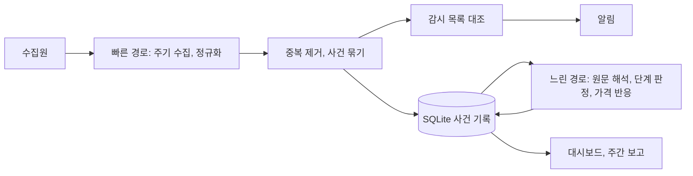

# 수집 프로그램 설계 (v1 초안)

상태: 초안 (2026-09-30). [open-questions.md](open-questions.md)의 미결 사항이 정해지면 갱신한다. 요금과 이용 조건은 바뀔 수 있으므로 확인 날짜와 함께 적고, 구현 직전에 다시 확인한다.

## 1. 목표

- 기관 발표, 프로젝트 발표, 뉴스, 가격과 거래소 자료를 주기적으로 수집한다.
- 같은 발표를 다룬 여러 자료를 하나의 사건으로 묶고, 연결된 토큰, 연결 등급, 사업 단계 변화를 기록한다.
- 중요한 변화만 알린다.
- [hypotheses.md](hypotheses.md)의 가설을 검증할 수 있도록 사건 기록을 쌓는다. 이 프로그램에서 가장 중요한 산출물은 알림보다 사건 기록이다.

조사 원칙은 [research-principles.md](research-principles.md)를 따른다. 프로그램은 원칙을 다음 기능으로 구현한다.

| 조사 원칙 | 프로그램 기능 |
|---|---|
| 기관에서 토큰으로 내려오는 조사 | 기관 → 업무 → 프로젝트 → 토큰 연결을 저장하고, 새 자료를 이 연결과 대조 |
| 사업 단계 기록 | 새 자료에서 단계가 바뀌었는지 판정하고 "다음 확인 조건"과 대조 |
| 시간 구분 | 최초 발표, 수정, 발견 시각을 따로 저장하고 재확산을 표시 |
| 사업과 토큰의 분리 | 연결 등급과 토큰 언급 여부를 별도 필드로 저장 |
| 뉴스와 가격 반응의 분리 | 사건 평가와 가격 반응을 별도 테이블에 저장 |
| 반대 증거 기록 | 출시 지연, 협업 종료, 반응 없음도 사건으로 저장 |

## 2. 구조: 빠른 경로와 느린 경로

| 경로 | 주기 | 하는 일 | AI 사용 |
|---|---|---|---|
| 빠른 경로 | 1~5분 | 가격, 거래량, 거래소 비중의 이상 감지. 새 제목을 감시 목록과 대조. 알림 발송 | 사용하지 않음 |
| 느린 경로 | 1시간~1일 | 기관 원문 해석, 연결 등급과 사업 단계 판정, 사건 기록 보완, 가격 반응 계산 | 필요한 건만 사용 |

두 경로로 나누는 이유는 다음과 같다. 급등형 움직임은 하루 안에 되돌려지기도 하므로 빨리 감지해야 한다. 반면 지속형 움직임은 며칠에 걸쳐 진행되므로, 몇 분 빨리 아는 것보다 해석이 정확한 것이 더 중요하다. 근거는 [2026-09-30 검토](../research/2026-09-30-claude-review/review.md)에 있다.

## 3. 수집원

v1은 무료 출처만 쓴다. "확인" 열이 "미확인"인 항목은 구현 전에 이용 조건과 접근 방식을 확인한다.

| 수집원 | 용도 | 방식 | 조건과 주의 | 확인 |
|---|---|---|---|---|
| DTCC 보도자료 | 기관 발표 | 공식 RSS | | 미확인 (Codex 인용) |
| SEC 보도자료, 발언 | 규제, ETF | 공식 RSS | | 미확인 (Codex 인용) |
| SEC EDGAR | ETF 신청(S-1, 19b-4), 상장사의 토큰 매입 공시(8-K) | EDGAR 검색, 공시 RSS | 요청 헤더(User-Agent)에 이름과 연락처를 넣고 요청 빈도 제한을 지킨다 | 미확인 |
| 연준 | 거시 정책 | 공식 RSS | | 미확인 (Codex 인용) |
| PR Newswire, Business Wire, GlobeNewswire | 기관과 프로젝트의 보도자료 | RSS | 배포처별 이용 조건 확인 | 미확인 |
| 프로젝트 공식 블로그 (Chainlink, Hedera, Stellar, Quant, Ondo 등) | 프로젝트 발표 | RSS 우선, 없으면 공개 페이지 변경 확인 | robots.txt와 이용 조건 확인 | 미확인 |
| Google News RSS 검색 | 새로운 기관 연결 발굴 | 키워드 조합 검색 RSS | 반영이 늦을 수 있다 | 미확인 |
| 텔레그램 공개 채널 | 속보 | 텔레그램 공식 API (Telethon 라이브러리) | API 키(api_id) 발급, 요청 한도 준수 | 미확인 |
| 업비트 | 국내 가격과 거래대금, 김치 프리미엄 | 공개 API (키 불필요) | 요청 한도 준수 | 2026-09-30 작동 확인 |
| CoinGecko | 전체 가격, 시총, 거래량 | 공개 API | 키 없이 호출하면 제한이 걸린다. 무료 Demo 키를 쓴다 | 2026-09-30 키 없는 호출에서 제한 확인 |
| 코인베이스 | 미국 거래 비중과 가격 프리미엄 | 공개 시장 데이터 API | | 미확인 |
| 무기한 선물 거래소 (바이낸스, 바이빗 등) | 미결제약정, 펀딩비 | 공개 API | 접속 지역 제한이 있다. 바이낸스 API는 2026-09-30 미국 소재 클라우드 환경에서 거부되었으므로, 설치 장소에서 접속되는지 확인한다 | 일부 확인 |
| ETF 흐름 | 토큰 직접 수요 | 운용사 공개 보유량, 집계 사이트 | 출처별 이용 조건 확인 | 미확인 |

제외하거나 보류한 수집원은 다음과 같다.

- X 웹 스크래핑과 비공식 수집기(twscrape 등): X 이용약관은 사전 서면 동의 없는 크롤링과 스크래핑을 금지한다. 로그인에 쓴 계정이 정지될 위험도 있으므로 제외한다. 이 결정은 잠정적이며, [open-questions.md](open-questions.md) Q4에서 다룬다.
- X 공식 API: 유료다. 2026-09-30 X 공식 문서 기준으로 게시물 읽기 1건당 $0.005다. 1~2주 운영한 뒤 놓친 뉴스가 X에 집중되어 있을 때만 소수 계정에 대해 검토한다.
- FinancialJuice: Codex 답변에 따르면 공개 약관에 자동 수집에 대한 서면 허용 조건이 있다. 허용을 확인하기 전에는 자동으로 수집하지 않는다.

## 4. 수집 규칙

- 조건부 요청(ETag, If-Modified-Since)을 써서 바뀐 내용만 받는다.
- 출처별로 최소 요청 간격을 둔다. 기본 주기는 5분이며, 출처가 더 긴 간격을 요구하면 그 조건을 따른다.
- 요청이 실패하면 간격을 점점 늘려 가며 다시 시도한다.
- 출처별로 마지막 정상 확인 시각을 저장하고 대시보드에 표시한다. "새 자료 없음"과 "확인 실패"를 구분한다.
- 인터넷 연결이 끊겼다가 돌아오면, 마지막으로 수집한 시점 이후의 자료를 가능한 범위에서 보충한다.
- 5분은 확인 간격일 뿐이다. 원문 게시와 API 반영에 지연이 있으므로, 발표 후 5분 안에 발견한다고 보장하지 않는다.
- 기사와 보도자료는 제목, 링크, 짧은 발췌만 저장한다. 전문은 저장하지 않는다.

## 5. 사건 기록 구조 (초안)

시각은 UTC ISO 8601 형식으로 저장하고, 화면에는 KST로 표시한다.

| 테이블 | 역할 | 주요 필드 |
|---|---|---|
| sources | 수집원 | id, name, kind (rss, api, page, telegram), url, poll_interval_sec, last_ok_at, last_error_at, last_error |
| items | 수집한 개별 자료 | id, source_id, url, canonical_url, title, published_at, updated_at, fetched_at, content_hash, excerpt |
| events | 여러 자료를 묶은 사건 | id, title, first_published_at, first_seen_at, kind (new, update, rerun, unverified), stage_before, stage_after, token_mention (yes, no, unknown), summary, next_check, reviewed_by (ai, human) |
| event_items | 사건과 자료의 연결 | event_id, item_id |
| event_assets | 사건과 토큰의 연결 | event_id, symbol, directness (direct, project_claim, indirect, association), evidence_quote, evidence_url |
| price_reactions | 가격 반응 | event_id, symbol, window (pre_24h, 1h, 6h, 24h, 3d, 7d), asset_return, btc_return, bucket_median_return, status (measured, pending) |
| venue_shares | 거래소별 비중 | ts, symbol, venue, volume_usd, share, premium |
| flows | 토큰 직접 수요 | date, symbol, kind (etf, treasury, buyback), amount_usd, source_url |
| runs | 수집 실행 기록 | id, source_id, started_at, finished_at, status, items_new, error |

## 6. 알림 기준 (초안)

알림을 보내는 경우는 다음과 같다.

- 감시 목록에 있는 기관이나 프로젝트가 등장한 새 사건 가운데, 연결 등급이 "직접" 또는 "프로젝트 측 발표"인 사건
- [institution-map.md](institution-map.md)의 "다음 확인 조건"에 해당하는 변화
- 감시 종목의 가격이나 거래소 비중에서 나타난 이상 (기준값은 운영하면서 정한다)
- 수집 장애 (한 출처가 정해진 시간 이상 계속 확인에 실패한 경우)

재확산으로 분류된 사건과 연상 등급만 있는 사건은 알림을 보내지 않고 대시보드에만 표시한다. 알림 채널은 [open-questions.md](open-questions.md) Q3에서 정한다.

## 7. AI 사용

- 빠른 경로에서는 AI를 쓰지 않고, 규칙과 연결표로 처리한다.
- 느린 경로의 해석 작업은 다음 방식 가운데 하나로 처리한다. 선택은 [open-questions.md](open-questions.md) Q8에서 정한다.
  - 구독 계정으로 로그인한 CLI를 비대화형으로 실행한다 (예: Claude Code의 `claude -p`, Codex CLI의 `codex exec`). 추가 비용은 없지만, 대화형 사용과 사용 한도를 공유한다.
  - API를 쓴다. 사용한 만큼 과금되므로 월 지출 상한을 설정한다.
  - 로컬 모델을 쓴다. 맥북 사양에 따라 가능 여부와 속도가 달라진다.
- 어떤 방식이든 호출 횟수에 상한을 두고, 상한에 도달하면 대시보드에 표시한다.
- AI가 판정한 결과에는 근거 원문 링크와 인용 문장을 반드시 붙이고, 사람이 확인하기 전까지 "AI 판정"으로 표시한다.
- 5분마다 AI에게 웹 검색을 시키지 않는다. 원문은 프로그램이 직접 수집하고, 새 자료만 AI에게 보낸다.

## 8. 실행 환경 (맥북 기준 초안)

맥북 모델과 macOS 버전은 아직 정해지지 않았다 ([open-questions.md](open-questions.md) Q2).

- Python 3.11 이상, 가상환경, SQLite를 쓴다. v1은 Docker 없이 구성한다.
- launchd의 LaunchAgent로 자동 실행과 재시작을 관리한다.
- 전원이 연결된 상태에서 시스템 잠자기를 끈다. 외부 모니터 없이 덮개를 닫으면 잠자기에 들어가므로, 덮개를 열어 두거나 별도 설정을 한다.
- FileVault가 켜져 있으면 재부팅 후 로그인하기 전까지 LaunchAgent가 실행되지 않는다. 정전 뒤 자동으로 켜지게 하는 설정과 함께 운영 방식을 정한다.
- 수집이 멈췄다는 사실을 프로그램이 스스로 알릴 수는 없다. 외부의 무료 감시 서비스(예: healthchecks.io)에 주기적으로 신호를 보내고, 신호가 끊기면 휴대전화로 알림을 받는다.
- 항상 전원에 연결해 두므로 배터리의 최적화된 충전 기능을 켠다.
- 비밀 값은 `.env` 파일에 두고 커밋하지 않는다.
- 대시보드는 로컬 웹 서버로 띄우고, 기본적으로 맥북 안에서만 접속한다.

맥북 외의 대안으로는 클라우드 무료 VM이 있다. GitHub Actions 예약 실행은 짧은 주기에서 실행이 지연될 수 있고, 수집 결과가 공개 저장소에 노출될 수 있으므로 v1에는 쓰지 않는다.

## 9. 운영 평가 (첫 1~2주)

- 놓친 사건과, 그 사건이 있던 출처
- 잘못 연결한 종목
- 중복 알림
- 발표 시각부터 발견 시각까지의 지연
- 실제로 든 비용
- 쌓인 사건 기록이 가설을 검증하기에 충분한지

## 10. 비용 참고

- X API: 게시물 읽기 1건당 $0.005 (2026-09-30 X 공식 문서 확인). 하루 100건을 읽으면 30일에 약 $15다.
- 웹 검색 도구가 포함된 AI API를 5분마다 호출하면 30일에 8,640회가 된다. Codex 답변은 OpenAI 웹 검색 도구 기준으로 검색 도구료만 약 $86.40이고 모델 사용료가 추가된다고 계산했다 (미재확인).
- 구독 계정의 CLI를 쓰면 추가 비용은 없지만 사용 한도를 공유한다.
